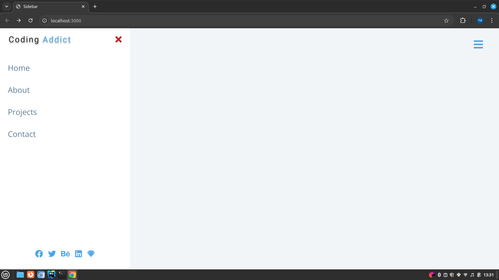

# Sidebar

This project implements a responsive sidebar navigation menu using HTML, CSS, and JavaScript.

# Features


```
Responsive Design: 
The sidebar is hidden by default on smaller screens and can be toggled using a button.

Smooth Toggle Animation:
Users can show or hide the sidebar using the provided toggle button.

Close Button: 
A close button inside the sidebar allows users to hide it with ease.

Social Media Links: 
The sidebar includes social media icons that link to external sites.

Customizable Links: 
The sidebar contains navigational links to different pages (Home, About, Projects, Contact).
```

# How to Use

Clone the repository and navigate to the project folder.

Open index.html in your browser to see the sidebar in action.

Customize the links and styles as needed for your project.

# Screenshot app

